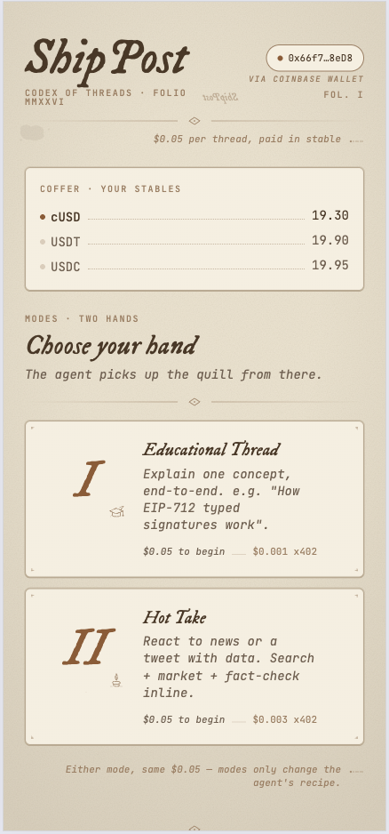
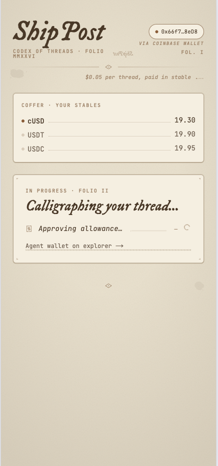
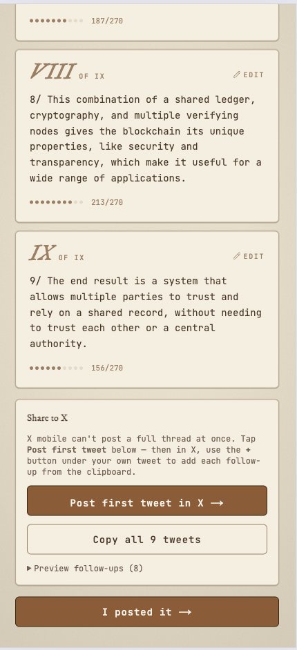

# CoinOp

> Formerly **ShipPost** — the on-chain contract keeps the historical name `ShipPostPayment`.

> Pay $0.05. Get a ready-to-post X thread. No subscription, no prompt engineering.

CoinOp is a pay-per-use AI thread writer running as a MiniApp inside Opera's MiniPay wallet. Each thread costs $0.05 in cUSD, USDT, or USDC. An ERC-8004 agent wallet makes 1–4 micro-payments (x402) to AI services (Groq, Serper, CoinGecko) to generate a ready-to-post X thread, streamed live with cost transparency.

**Proof of Ship — MiniPay MiniApp (AI Agents) category** · Celo mainnet · April–May 2026

---

## How it works

1. User opens CoinOp inside MiniPay on Android
2. Picks a mode (Educational or Hot Take) and enters a topic
3. Approves a one-time $0.05 stablecoin payment via `payForThread`
4. The agent wallet makes x402 micro-payments to AI services in real time
5. A multi-tweet thread streams back, editable and shareable to X

### Modes

| Mode | Steps | Cost breakdown |
|------|-------|---------------|
| **A — Educational** | Groq generate | ~$0.01 Groq |
| **B — Hot Take** | Serper search → CoinGecko price → Groq generate → fact-check | ~$0.01–0.02 total |

---

## Deployed contracts

### Celo Mainnet (chainId 42220)

| Contract | Address |
|----------|---------|
| ShipPostPayment | [`0xfe9a248ea318ef0169cb542e299b183748009b81`](https://celo.blockscout.com/address/0xfe9a248ea318ef0169cb542e299b183748009b81#code) |
| AgentWallet | [`0x006cba3012139c299aa4a522697b4a0c49f38895`](https://celo.blockscout.com/address/0x006cba3012139c299aa4a522697b4a0c49f38895#code) |

### Celo Sepolia Testnet (chainId 11142220)

| Contract | Address |
|----------|---------|
| ShipPostPayment | [`0x277e140933d600cafcad38e2f1018e4fbd5476b2`](https://celo-sepolia.blockscout.com/address/0x277e140933d600cafcad38e2f1018e4fbd5476b2) |
| AgentWallet | [`0x7538627c5eef2193fa4960f03157f482eca333be`](https://celo-sepolia.blockscout.com/address/0x7538627c5eef2193fa4960f03157f482eca333be) |

---

## Architecture

### Two-layer model

CoinOp spans **two chains on purpose** — each is a separate layer with one chain,
not a "multi-chain" app. The mental model is one sentence: **users pay on Celo; the
agent pays AI services via x402 on Base.**

```
┌────────────────────────────────────────────────────────────────────────┐
│  LAYER 1 · Payment          chain: Celo (42220)   token: cUSD/USDT/USDC  │
│  why this chain: MiniPay lives on Celo                                   │
│                                                                          │
│   User (MiniPay)  ──$0.05──►  ShipPostPayment.sol                        │
│                                  └─ split 50 / 40 / 10                    │
│                                     → AgentWallet · treasury · reserve    │
└────────────────────────────────────────────────────────────────────────┘
                         │  thread request (payment verified on-chain)
                         ▼
               /api/generate/stream   ·   pipeline orchestrator
                         │  agent pays per AI call
                         ▼
┌────────────────────────────────────────────────────────────────────────┐
│  LAYER 2 · Agent x402 spend  chain: Base (8453)    token: USDC           │
│  why this chain: x402's home turf — Coinbase CDP facilitator             │
│                                                                          │
│   Agent EOA  ──sign EIP-3009──►  /api/x402/groq                          │
│                                     └─ CDP facilitator verifies + settles │
│                                        → 0.001 USDC → treasury  (gasless) │
└────────────────────────────────────────────────────────────────────────┘
```

The two layers are independent: which chain the user paid on does **not** dictate
where the agent settles its AI spend. Config reflects this split —
`lib/chains.ts` / `tokens.ts` / `contracts.ts` are Celo-only (Layer 1);
`lib/x402/config.ts` is Base-only (Layer 2).

> **Current state (honest):** Layer 2 is **proven live on Base mainnet**
> ([tx `0x7b71d5f7…92db1`](https://basescan.org/tx/0x7b71d5f74b832abab6c807ba0daccadbf62d4ca4dc5fda80c059bb14e3b92db1),
> see [docs/x402-mainnet-proof.md](docs/x402-mainnet-proof.md)). Production MiniPay
> threads still settle on Celo via the legacy path; routing every thread through
> Layer 2 (decoupling the settle decision from the payment chain) is a tracked
> next step, not a flag flip.

### Component view

```
MiniPay (Android)
    └─ CoinOp frontend (Next.js 14, App Router)
           ├─ ShipPostPayment.sol  ← pulls $0.05, splits 50/40/10 to agent/treasury/reserve
           ├─ AgentWallet.sol      ← ERC-8004, $10/day spend cap, executes x402 calls
           └─ /api/generate/stream (SSE)
                  └─ in-process pipeline: groq · serper · coingecko · fact-check
                     steps — each settles via AgentWallet (Model 1, no HTTP route)
```

### On-chain

- **`ShipPostPayment.sol`** — `payForThread(token, mode)` pulls exactly $0.05, splits to three addresses, emits `ThreadRequested`. Token whitelist enforced. Decimal-safe via `IERC20Metadata(token).decimals()`.
- **`AgentWallet.sol`** — ERC-8004 compatible. Owner is the orchestrator EOA. `executeX402Call` enforces the $10/day spend cap per token and emits `X402PaymentMade`.

### x402 settlement — two models

**Model 1 — per-thread generate (Celo).** Groq, Serper, and CoinGecko don't support x402 natively, so each pipeline step *simulates* x402 in-process by pulling stablecoin from AgentWallet via `settleX402Call`. There are **no public `/api/x402/*` proxy routes** for these — the earlier unauthenticated proxies were removed in `8f4c222` (free-drain risk).

**Model 2 — `/api/x402/groq` (Base).** A genuine x402 endpoint: the *caller* pays *us* in USDC through the Coinbase CDP facilitator, settling to the treasury. It does **not** touch AgentWallet. Proven live on Base mainnet ([tx `0x7b71d5f7…92db1`](https://basescan.org/tx/0x7b71d5f74b832abab6c807ba0daccadbf62d4ca4dc5fda80c059bb14e3b92db1)). See [docs/x402-mainnet-proof.md](docs/x402-mainnet-proof.md) and [docs/ARCHITECTURE.md](docs/ARCHITECTURE.md) §2.3.

### Pipeline

`lib/pipeline/` — step abstraction used by the SSE endpoint. Each step fires one x402 call and emits a `PipelineEvent` with `{ step, status, cost }` streamed to the `useThreadGeneration` hook.

---

## Demo

<div align="center">
  <table>
    <tr>
      <td align="center" width="33%">
        
        <br />
        <b>Mode Selection</b><br/>
        <small>Choose Educational or Hot Take mode</small>
      </td>
      <td align="center" width="33%">
        
        <br />
        <b>Live Progress</b><br/>
        <small>Real-time x402 cost breakdown per step</small>
      </td>
      <td align="center" width="33%">
        
        <br />
        <b>Thread Preview</b><br/>
        <small>Editable tweet cards, ready to share</small>
      </td>
    </tr>
  </table>
</div>

---

## Tech stack

| Layer | Tech |
|-------|------|
| Frontend | Next.js 14 (App Router), React 18, Framer Motion, Tailwind CSS |
| Wallet | wagmi v2, viem, RainbowKit (MiniPay auto-connect via injected provider) |
| Contracts | Solidity 0.8.24, Hardhat, hardhat-toolbox-viem |
| AI | Groq (llama-3.3-70b), Serper, CoinGecko |
| Database | Supabase (server-side only, thread metadata) |
| Chain | Celo mainnet + Celo Sepolia testnet |

---

## Quick start

```bash
pnpm install
cp .env.example .env.local   # fill in required vars (see below)
pnpm dev
```

Open `http://localhost:3000`. MiniPay auto-connects when running inside the wallet; on desktop, use RainbowKit to connect a browser wallet on Celo network.

---

## Environment variables

Copy `.env.example` to `.env.local` and fill in:

| Variable | Required | Description |
|----------|----------|-------------|
| `DEPLOYER_PRIVATE_KEY` | Deploy only | Deployer EOA private key |
| `AGENT_WALLET_PRIVATE_KEY` | Server | Orchestrator EOA — owns AgentWallet, signs x402 settlements |
| `GROQ_API_KEY` | Server | Groq API key (free tier works) |
| `SERPER_API_KEY` | Server | Serper.dev key (2,500 free queries) |
| `COINGECKO_API_KEY` | Optional | CoinGecko Demo key (falls back to public endpoint) |
| `NEXT_PUBLIC_SUPABASE_URL` | Server | Supabase project URL |
| `SUPABASE_SERVICE_ROLE` | Server | Supabase service role key |
| `REFUND_ADMIN_KEY` | Server | Random hex for `/api/refund` gate (`openssl rand -hex 24`) |
| `NEXT_PUBLIC_WALLETCONNECT_PROJECT_ID` | Optional | Reown project ID (not needed for MiniPay) |
| `NEXT_PUBLIC_PAYMENT_CONTRACT_MAINNET` | Frontend | ShipPostPayment mainnet address |
| `NEXT_PUBLIC_AGENT_WALLET_MAINNET` | Frontend | AgentWallet mainnet address |

Mainnet contract addresses are already filled in `.env.example` after deployment.

---

## Commands

```bash
# Development
pnpm dev                    # Next.js dev server
pnpm build                  # Production build
pnpm lint                   # ESLint

# Contracts
pnpm compile                # Compile Solidity
pnpm test:contracts         # Hardhat tests (13 tests)
pnpm test:lib               # Vitest unit tests (threadParser, etc.)
pnpm deploy:testnet         # Deploy to Celo Sepolia

# Mainnet deploy
npx hardhat run scripts/deploy-mainnet.ts --network celo

# Operations
pnpm refund                 # Admin refund CLI
pnpm hardhat run scripts/pause.ts --network celo    # Emergency pause
pnpm analyze                # Bundle size analysis
```

---

## Project structure

```
app/
  api/
    generate/stream/     # SSE endpoint — runs pipeline, logs to Supabase
    x402/                # groq / serper / coingecko / fact-check proxies
    public/              # analytics + threads public API
  history/               # per-wallet thread history
  stats/                 # public analytics page
  HomeClient.tsx         # main app UI (mode picker → payment → generation → preview)
components/
  GeneratingStatus.tsx   # progress theatre with live x402 cost per step
  ThreadPreview.tsx      # tweet cards with inline edit
  ShareToX.tsx           # twitter:// deep link + web fallback
  ErrorSurface.tsx       # 8 error states (insufficient / cap-hit / paused / …)
contracts/
  AgentWallet.sol
  ShipPostPayment.sol
lib/
  pipeline/              # step abstraction (groqStep, serperStep, coingeckoStep, …)
  prompts/               # LLM prompt templates
  chains.ts              # getChain / explorerBase / isSupportedChain
  contracts.ts           # ABI + addresses for both chains
  tokens.ts              # token configs (mainnet + testnet)
  wagmi.ts               # wagmi config
scripts/
  deploy.ts              # testnet deploy (mock tokens)
  deploy-mainnet.ts      # mainnet deploy (real tokens, $10/day cap)
  pause.ts               # emergency pause/unpause
  refund.ts              # admin refund
deployments/
  celo.json              # mainnet deployment record
  celoSepolia.json       # testnet deployment record
supabase/
  migrations/            # schema (threads table)
```

---

## Safety

- **Pausable** — both contracts have an owner-only kill switch (`pause()` / `unpause()`)
- **Daily spend cap** — AgentWallet enforces $10/day per token; resets at UTC midnight
- **Token whitelist** — only cUSD, USDT, USDC accepted by ShipPostPayment
- **Decimal-safe** — all token math uses `IERC20Metadata(token).decimals()`, never hardcoded
