# ShipPost — Kiến trúc

> Tài liệu viết theo kiểu **phóng to dần** (progressive disclosure): đọc từ trên xuống, dừng
> ở tầng nào đủ hiểu thì dừng.
>
> | Tầng | Cho ai | Đọc gì |
> |---|---|---|
> | **0 — TL;DR** | mọi người, 30 giây | hệ thống làm gì, gồm mấy mảnh |
> | **1 — Bức tranh lớn** | PM, người mới, fullstack | 2 lớp + một lượt generate chạy ra sao |
> | **2 — Từng phần** | dev sắp sửa code mảng đó | mỗi mảng: làm gì · gọi ai · invariant chính |
> | **3 — Đào sâu** | review bảo mật, sửa lõi | các bất biến nhạy cảm, từng bước một |
>
> Sơ đồ dùng [Mermaid](https://mermaid.js.org) (render trên GitHub; VS Code cần extension
> "Markdown Preview Mermaid Support"). Tham chiếu code theo **tên symbol** để `grep` ra được và
> không lệch khi số dòng đổi. **Code là nguồn sự thật** — lệch thì sửa file này.

---

# Tầng 0 — TL;DR (30 giây)

ShipPost là app **trả-tiền-theo-lượt** viết thread X bằng AI, chạy như MiniApp trong ví MiniPay
của Opera. Người dùng trả **$0.05** (cUSD/USDT/USDC) → một **ví agent** (ERC-8004) tự bỏ tiền
gọi vài dịch vụ AI (Groq, Serper, CoinGecko) → trả về một thread sẵn-sàng-đăng.

Bốn nhân vật, đọc theo số ①→⑥:

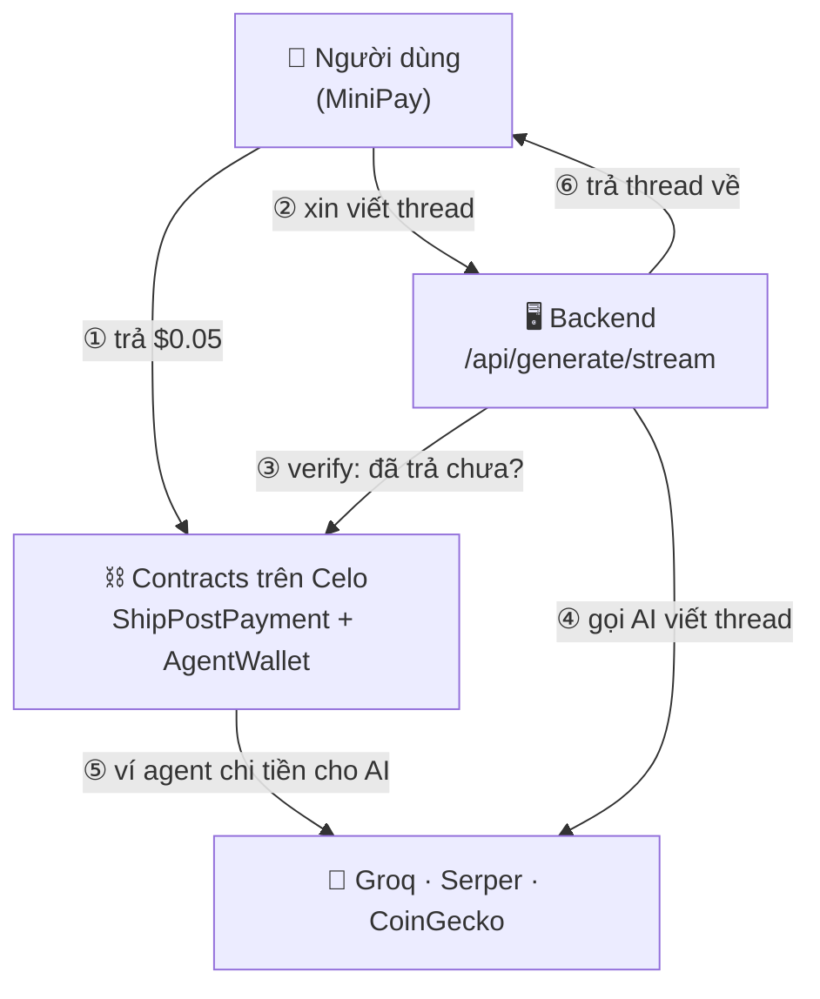

**Một câu để nhớ:** blockchain ở đây **không chạy AI** — nó là *sổ kế toán bất biến* cho cả thu
lẫn chi; AI chạy off-chain trong backend.

---

# Tầng 1 — Bức tranh lớn

## Hai lớp tách bạch

Toàn hệ thống chia làm **2 lớp**, nối nhau bằng đúng một thứ: `payTxHash` (bằng chứng đã trả).

| Lớp | Gồm gì | Trách nhiệm |
|---|---|---|
| **Lớp 1 — On-chain (Celo)** | `ShipPostPayment` + `AgentWallet` | Thu tiền (`payForThread`) và chi tiền (`executeX402Call`), để lại event/tx bất biến |
| **Lớp 2 — Backend (Next.js SSE)** | `/api/generate/stream` + pipeline | Verify thanh toán, gọi AI off-chain, settle x402, stream kết quả về client |

Vì sao tách: contract đơn giản → rẻ và an toàn; backend không được tin → phải *chứng minh lại*
mọi thứ từ chain. (Frontend và Data nằm trong Lớp 2 về mặt khái niệm — xem Tầng 2.)

## Một lượt generate chạy ra sao (đọc từ trên xuống)

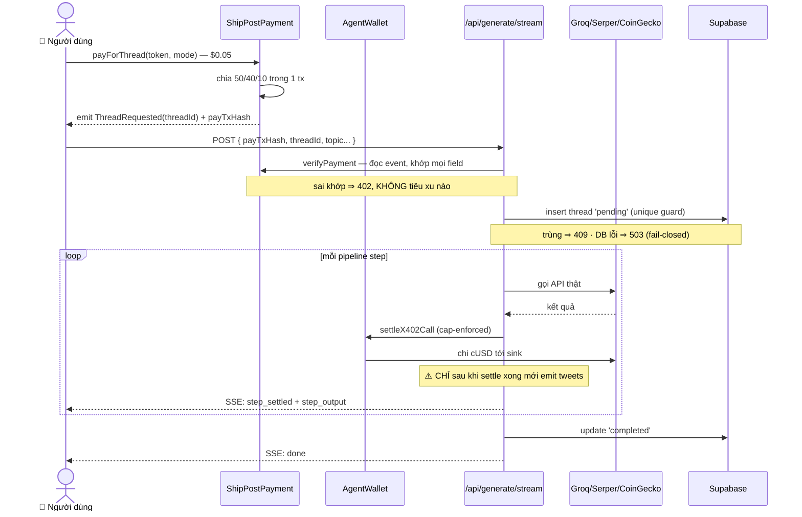

> **Dừng ở đây là đủ cho hầu hết người đọc.** Cần biết một mảng cụ thể làm gì → Tầng 2.
> Cần hiểu *vì sao* một bất biến tồn tại → Tầng 3.

---

# Tầng 2 — Từng phần (vừa phải)

Mỗi mục theo công thức: **làm gì · gọi ai · invariant chính**.

## 2.1 On-chain — `contracts/`

Hai contract, deploy trên Celo Sepolia testnet (11142220) và Celo mainnet (42220). Alfajores đã
bị Celo khai tử — dùng Celo Sepolia cho testnet.

**`ShipPostPayment`** — máy chia tiền. `payForThread` kéo $0.05 từ user, chia tức thì rồi emit:

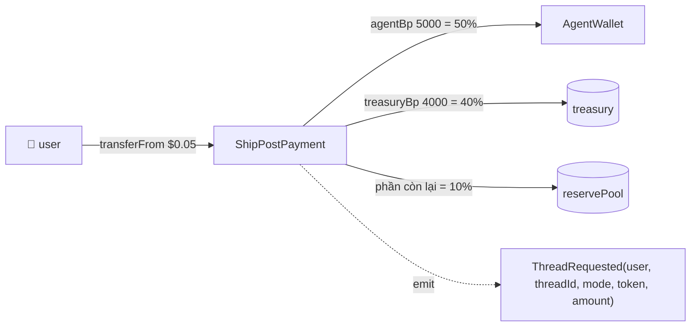

- **Làm gì:** thu tiền, chia 50/40/10, phát `ThreadRequested`.
- **Invariant:** đa token không hardcode decimals (`requiredAmount` đọc `decimals()`); wei lẻ luôn
  rơi vào reserve (dùng phép trừ); `ThreadRequested` chính là API mà backend đọc ngược để verify.

**`AgentWallet`** — ví agent ERC-8004, giữ stablecoin để chi x402.
- **Làm gì:** `executeX402Call` chuyển tiền cho dịch vụ, kèm **daily spend cap** $10/token/ngày (mainnet; $50 testnet).
- **Gọi bởi:** chỉ owner (orchestrator EOA của backend).
- **Invariant:** cap chặn blast-radius nếu key lộ; `Pausable` là kill-switch (nhưng
  `emergencyWithdraw` cố tình vẫn chạy khi paused — chi tiết Tầng 3).

## 2.2 Backend — `/api/generate/stream`

Trái tim Lớp 2. `POST` (`app/api/generate/stream/route.ts`) spends cUSD thật mỗi lượt, nên coi
body là **thù địch**. Ba cổng gác trước khi tiêu xu nào:

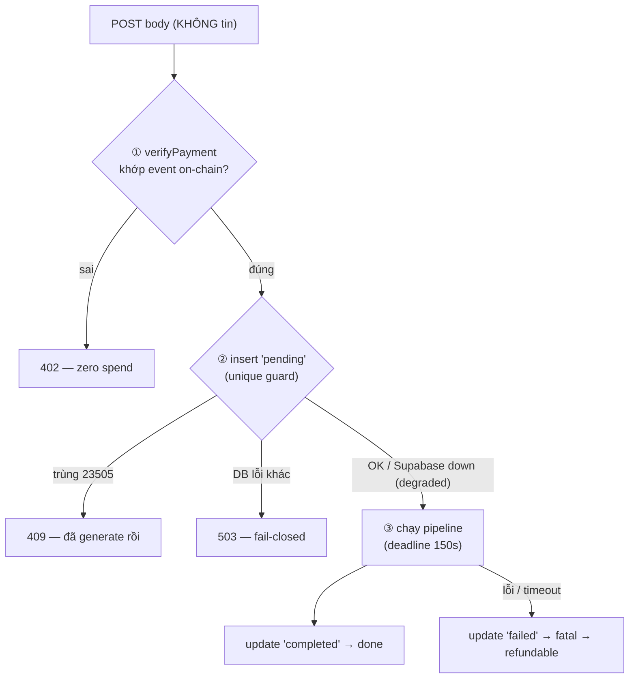

- **Làm gì:** verify thanh toán → chống replay → chạy pipeline → stream SSE.
- **Gọi ai:** `verifyPayment`/`settleX402Call` (Lớp 1), Supabase, các API AI.
- **Invariant:**
  - Verify on-chain **trước** mọi việc tốn tiền; sai → 402, zero spend.
  - Một payment = một generation (unique index `(chain_id, onchain_thread_id)`).
  - **Mọi lỗi đều về trạng thái sạch, refund được** (vòng đời dưới).

Vòng đời một thread:

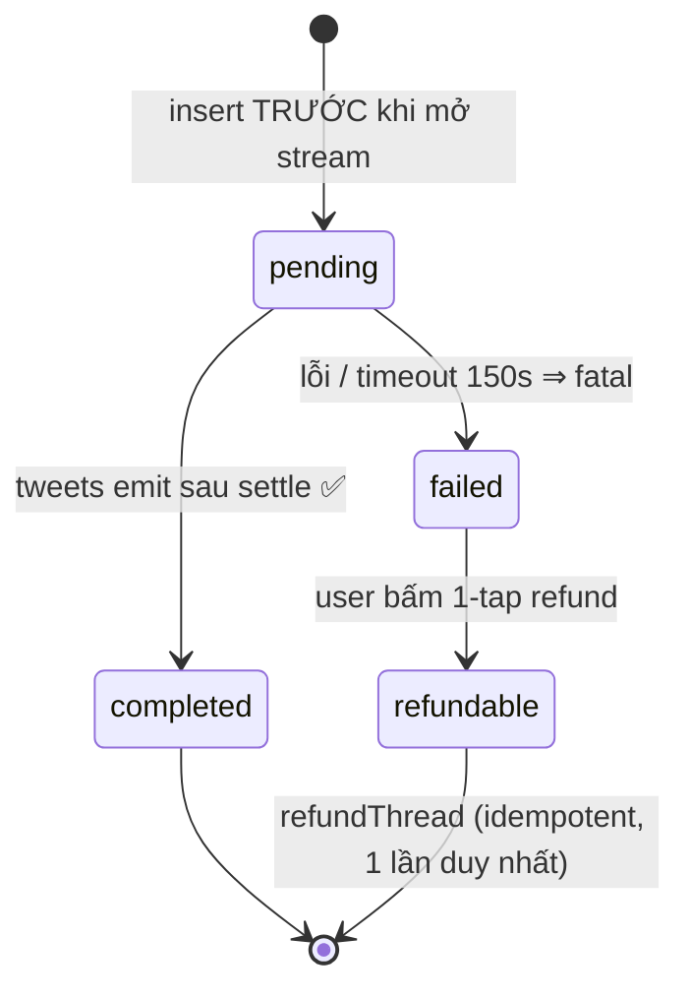

Pipeline có 2 mode (`runModeA` / `runModeB`) trong `lib/pipeline/`:

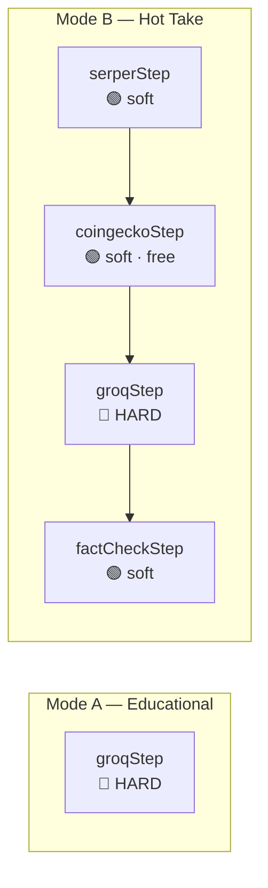

🟢 **soft-fail** → emit `step_failed` (không terminal), chạy tiếp với context null. 🔴 **hard-fail**
(groq) → `throw` → cả run fail → refundable. (Vì sao thứ tự emit quan trọng → Tầng 3.)

## 2.3 x402 — hai mô hình (ĐỪNG nhầm)

Codebase có **hai cơ chế khác bản chất**, cùng tên "x402", chảy tiền **ngược chiều nhau**.

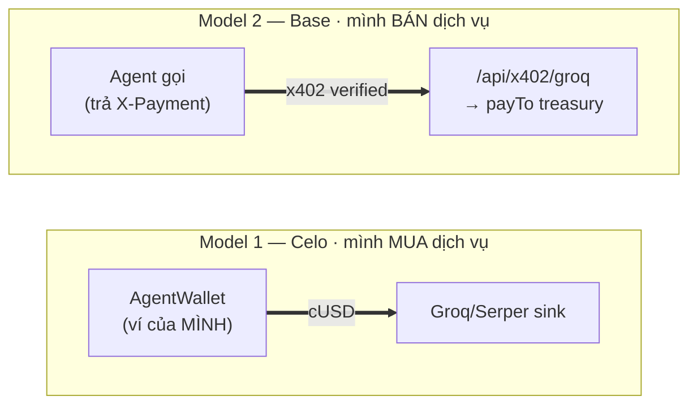

| | Model 1 — Celo in-process | Model 2 — `/api/x402/groq` |
|---|---|---|
| Vai trò | Mình **MUA** dịch vụ | Mình **BÁN** dịch vụ |
| Giao thức | Mô phỏng, không có `X-Payment` | x402 **thật** qua `@x402/next` |
| Ai trả | AgentWallet chi cho service | **Người gọi** trả cho mình |
| Settle về | sink/burn (`X402_SINK_ADDRESS`) | `X402_PAY_TO` treasury |
| Rủi ro nếu hở | Drain AgentWallet | Không — không trả thì không có content |
| Mạng | Celo (42220 / 11142220) | Base (84532 / mainnet) |

**Model 1** là luồng generate per-thread (mục 2.2): mỗi step gọi `settleX402Call` → `executeX402Call`
cap-enforced. Groq/Serper/CoinGecko không hỗ trợ x402 thật nên đây là mô phỏng in-process; **không
có HTTP proxy route**. **Model 2** (`app/api/x402/groq/route.ts`): `withX402` verify `X-Payment`
*trước* khi handler chạy, settle chỉ sau khi trả 200, **không chạm AgentWallet** → không drain risk.
Đã proof Base mainnet 2026-06-03 (CDP cần JWT request-scoped, fix ở commit `4c48a08`).

Lịch sử: route `/api/x402/*` *đời đầu* là proxy không xác thực gọi thẳng `settleX402Call` (drain
free) — xóa ở `8f4c222`; Model 2 hiện tại (`c8a796b`) là bản dựng lại an toàn. **Rule:** mọi x402
surface công khai phải verify `X-Payment` trước khi chi. Xem thêm `docs/x402-explained.md`,
`docs/x402-flow-diagrams.md`, `docs/x402-mainnet-proof.md`.

## 2.4 Frontend — `app/` + `components/` + `hooks/`

Next.js 14 App Router, **mobile-only** (MiniPay webview), **dark mode** mặc định, budget `<200KB`
gzipped trên `/`. Luồng client nối tiếp nhau:

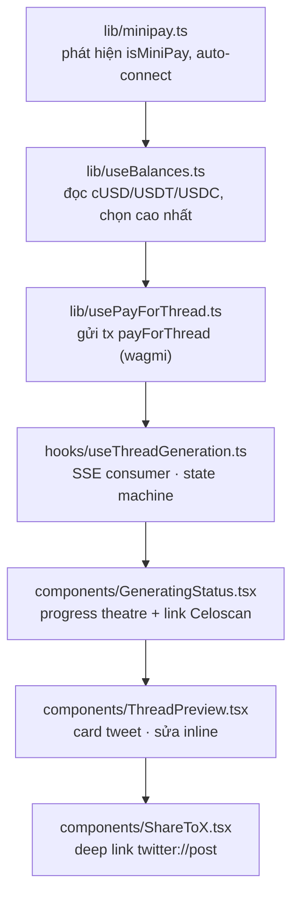

- **Invariant:** `useThreadGeneration` chỉ coi `fatal` là kết thúc lỗi; `step_failed` (soft) chỉ
  hiển thị degraded → khớp triết lý soft/hard ở 2.2.

## 2.5 Data — Supabase (`supabase/migrations/`)

- **Làm gì:** lưu wallet address + metadata thread (no PII); phục vụ history/analytics.
- **Gọi bởi:** chỉ server-side, **luôn dùng service role** (`getSupabaseServer`) bypass RLS — không
  có anon client. History/analytics qua edge-runtime routes (`/api/public/*`), trang `/app/history`,
  `/app/stats`.
- **Invariant:** `refund_requests` bật RLS không policy permissive (`0005`) → anon bị từ chối.

## 2.6 Refund — runbook

Hai đường settlement, đều gọi `refundThread` (`lib/agent/orchestrator.ts`):

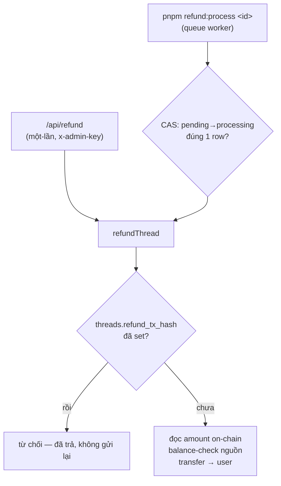

- **Invariant:** `threads.refund_tx_hash` là nguồn sự thật duy nhất — đã set ⇒ không bao giờ gửi lại.
  Số tiền đọc **on-chain** (`getOnChainPaidAmount`), không từ `amount_paid_raw` (client). Lock là
  compare-and-swap (`pending → processing` đúng 1 row). Send lỗi **không** tự revert về `pending`
  (tx có thể đã broadcast) — chỉ reset sau khi xác nhận on-chain không có transfer nào landed.

---

# Tầng 3 — Đào sâu (đọc khi sửa lõi / review bảo mật)

## 3.1 `verifyPayment` — từng bước (`lib/agent/orchestrator.ts`)

Body của `/api/generate/stream` hoàn toàn do attacker điều khiển, nên mọi field bị *chứng minh lại*
chứ không tin:

1. Lấy receipt của `payTxHash`, đòi `status === 'success'`.
2. **Quét log do *chính contract của mình* phát ra** (skip nếu `log.address` khác `ShipPostPayment`)
   — không tin `receipt.to`, để chịu được đường router/multicall.
3. Khớp `threadId`, `user`, `token`, `mode` với event `ThreadRequested`.
4. **Defense in depth:** đọc lại `requiredAmount` on-chain, đòi `evt.amount === required` — event
   giả mạo cũng không qua.

Trả về **số tiền on-chain** để backend lưu cái đó; **không bao giờ** lưu `amountPaidRaw` từ client.
Refund về sau tính theo `getOnChainPaidAmount`, không theo DB.

## 3.2 Settle gates delivery — vì sao thứ tự emit là bất biến

Trong `runGroqStep` và `runModeB`, settle **phải** xong *trước* khi giao nội dung. Đảo thứ tự =
tái sinh lỗ "free content + refund".

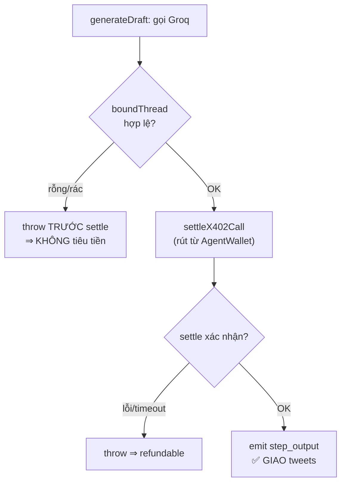

Output rỗng/rác → `boundThread` throw *trước* settle → không tiêu tiền. `waitForTransactionReceipt`
trong `settleX402Call` bounded 90s — RPC chết không treo cả generation.

## 3.3 Daily cap — chi tiết on-chain (`executeX402Call`)

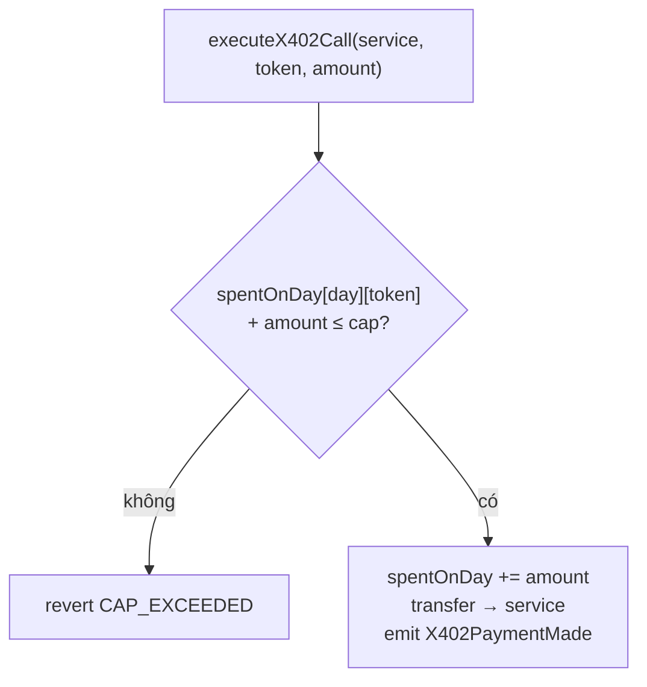

`currentDay() = block.timestamp / 1 days` (cửa sổ 24h UTC). Dù key orchestrator lộ, kẻ tấn công chỉ
rút tối đa $10/token/ngày (mainnet; $50 testnet). `Pausable` đóng băng `executeX402Call` và `approveFacilitator`, **nhưng
`emergencyWithdraw` cố tình vẫn chạy khi paused** — kill-switch để chặn *chi sai*, không phải để
*nhốt tiền*; owner phải luôn rút được ra.

## 3.4 Deadline nội bộ — vì sao 150s < 300s

`route.ts` export `maxDuration = 300`, nhưng pipeline tự đặt `PIPELINE_DEADLINE_MS = 150_000`
(`withDeadline`). Lý do: platform SIGKILL ở 300s là kill cứng, không emit `fatal`, thread kẹt
`'pending'` — trạng thái tệ nhất (đã trả, không content, không tự refund). Tự race timeout sớm hơn →
đi qua `catch` bình thường → `'failed'` + `fatal` → **refundable**.

## 3.5 ⚠️ Accounting caveat (tech debt đã biết)

Comment trên `refundThread`: contract chỉ route **10%** vào reserve, nhưng **full refund trả 100%**.
Phần chênh đang lấy từ balance của deployer EOA → **không bền vững**. Fix đúng là một `refund()`
on-chain rút từ reserve tích lũy. **Đừng scale full-refund trên path này.**

## 3.6 Năm bài học thiết kế

1. **On-chain = sổ kế toán bất biến, không phải máy tính.** Thu/chi để lại event/tx; AI off-chain.
2. **Không tin client — verify lại từ chain.** `verifyPayment` + amount on-chain là khuôn mẫu chống forge.
3. **Giới hạn blast radius bằng code:** daily cap, Pausable, whitelist token, insert fail-closed.
4. **Settle trước, giao hàng sau** — invariant chống "free content + refund".
5. **Mọi lỗi phải refundable**, kể cả timeout — deadline nội bộ thay vì để platform kill cứng.

---

# Phụ lục

## Chain config (`lib/`)

- `lib/chains.ts` — `getChain`, `explorerBase`, `isSupportedChain` (Celoscan/Blockscout).
- `lib/wagmi.ts` — connectors Celo mainnet (42220) + Celo Sepolia (11142220).
- `lib/tokens.ts` — địa chỉ + decimals token cho cả hai chain.
- `lib/contracts.ts` — địa chỉ ShipPostPayment + AgentWallet cho cả hai chain.

## Lệnh hay dùng

```bash
pnpm dev                 # dev server
pnpm build               # production build
pnpm test:contracts      # Hardhat tests
pnpm compile             # compile Solidity
pnpm deploy:testnet      # deploy Celo Sepolia (11142220)
pnpm refund:list         # liệt kê refund_requests đang pending
pnpm refund:process <id> # settle một refund đã queue
```

## Glossary

Thuật ngữ junior hay vấp khi đọc codebase này (xếp theo bảng chữ cái).

| Thuật ngữ | Nghĩa trong ShipPost |
|---|---|
| **AgentWallet** | Contract ví của agent, giữ stablecoin để chi x402; chỉ owner (orchestrator) gọi được, có daily cap. |
| **basis points (bp)** | Phần vạn. `10000 bp = 100%`. Fee split 5000/4000/1000 = 50/40/10%. |
| **boundThread** | Hàm validate output: thread rỗng/rác thì `throw` (xảy ra *trước* settle → không tiêu tiền). |
| **Celo** | Blockchain EVM (mainnet 42220, Sepolia testnet 11142220) — nơi 2 contract chạy. |
| **Celoscan / Blockscout** | Block explorer để tra cứu tx; link sinh từ `explorerBase()`. |
| **cUSD / USDT / USDC** | Ba stablecoin được whitelist. cUSD có 18 decimals, USDT/USDC có 6 → không hardcode. |
| **daily spend cap** | Hạn mức chi mỗi token mỗi 24h (UTC) trong `AgentWallet`; mặc định $10 trên mainnet ($50 testnet). Giới hạn blast-radius nếu key lộ. |
| **degraded mode** | Khi Supabase chết: vẫn phục vụ generate nhưng mất replay-guard (có chủ đích, không phải bug). |
| **ERC-8004** | Chuẩn ví cho agent tự trị; `AgentWallet` thiết kế tương thích. |
| **facilitator (CDP)** | Dịch vụ Coinbase Developer Platform verify + settle x402 **thật** (chỉ dùng ở Model 2 / Base). |
| **Mode A / Mode B** | A = Educational (`groqStep`); B = Hot Take (`serper → coingecko → groq → factCheck`). |
| **MiniPay** | Ví stablecoin của Opera (webview di động). App chạy như **MiniApp** bên trong nó. |
| **orchestrator** | EOA backend, là **owner** của `AgentWallet` — chiếc "chìa khoá vương miện"; ký `executeX402Call`. |
| **payTxHash** | Hash của tx `payForThread`; **bằng chứng đã trả** mà backend verify lại on-chain. |
| **pipeline step** | Một bước trong `lib/pipeline/`: gọi API thật + settle, phát ra một `PipelineEvent`. |
| **replay guard** | Chống dùng lại 1 payment 2 lần — unique index `(chain_id, onchain_thread_id)` trên `threads`. |
| **reservePool / treasury** | Ví nhận 10% / 40% của mỗi khoản thanh toán. |
| **RLS** | Row Level Security (Postgres/Supabase). `refund_requests` bật RLS, không policy → anon bị chặn. |
| **service role** | Key Supabase **bypass RLS**; chỉ dùng server-side (`getSupabaseServer`). Không có anon client. |
| **settle / settlement** | Chuyển stablecoin on-chain để "thanh toán" một lần gọi dịch vụ (`settleX402Call` → `executeX402Call`). |
| **sink** | Địa chỉ nhận tiền x402 ở Model 1; `X402_SINK_ADDRESS` chưa set = burn về `0x..dead` (demo). |
| **soft-fail / hard-fail** | soft = bước lỗi vẫn chạy tiếp (degraded); hard = lỗi làm cả run `fatal` → refundable. |
| **SSE** | Server-Sent Events — kênh stream một chiều backend → client (progress + tweets). |
| **thread / threadId** | "Thread" = chuỗi tweet sinh ra; `threadId` = id on-chain lấy từ event `ThreadRequested`. |
| **ThreadRequested** | Event `ShipPostPayment` phát khi trả tiền; là "API" mà `verifyPayment` đọc ngược. |
| **wagmi / viem** | Thư viện client EVM ở frontend (`wagmi`) và backend (`viem`). |
| **x402** | Cơ chế trả-tiền-theo-lần-gọi bằng stablecoin (HTTP 402). Lưu ý **2 model** khác nhau — xem §2.3. |
| **withX402** | Wrapper `@x402/next` cho Model 2: trả 402, verify `X-Payment`, settle sau khi handler trả 200. |
