# ShipPost — Kiến trúc

> Tài liệu viết theo kiểu **phóng to dần** (progressive disclosure): đọc từ trên xuống, dừng
> ở tầng nào đủ hiểu thì dừng.
>
> | Tầng | Cho ai | Đọc gì |
> |---|---|---|
> | **0 — TL;DR** | mọi người, 30 giây | hệ thống làm gì, gồm mấy mảnh |
> | **1 — Bức tranh lớn** | PM, người mới, fullstack | 2 lớp + một lượt generate chạy ra sao |
> | **2 — Từng phần** | dev sắp sửa code mảng đó | mỗi mảng: làm gì · gọi ai · invariant chính |
> | **3 — Đào sâu** | review bảo mật, sửa lõi | các bất biến nhạy cảm, từng bước một |
>
> Sơ đồ dùng [Mermaid](https://mermaid.js.org) (render trên GitHub; VS Code cần extension
> "Markdown Preview Mermaid Support"). Tham chiếu code theo **tên symbol** để `grep` ra được và
> không lệch khi số dòng đổi. **Code là nguồn sự thật** — lệch thì sửa file này.

---

# Tầng 0 — TL;DR (30 giây)

ShipPost là app **trả-tiền-theo-lượt** viết thread X bằng AI, chạy trên **Base** (USDC, gas được
paymaster tài trợ qua EIP-5792) và trên **Celo** như MiniApp trong ví MiniPay của Opera
(cUSD/USDT/USDC, user tự trả gas). Người dùng trả **$0.10** → một **ví agent** (ERC-8004) tự bỏ tiền
gọi vài dịch vụ AI (Groq, Serper, CoinGecko) → trả về một thread sẵn-sàng-đăng.

Bốn nhân vật, đọc theo số ①→⑥:

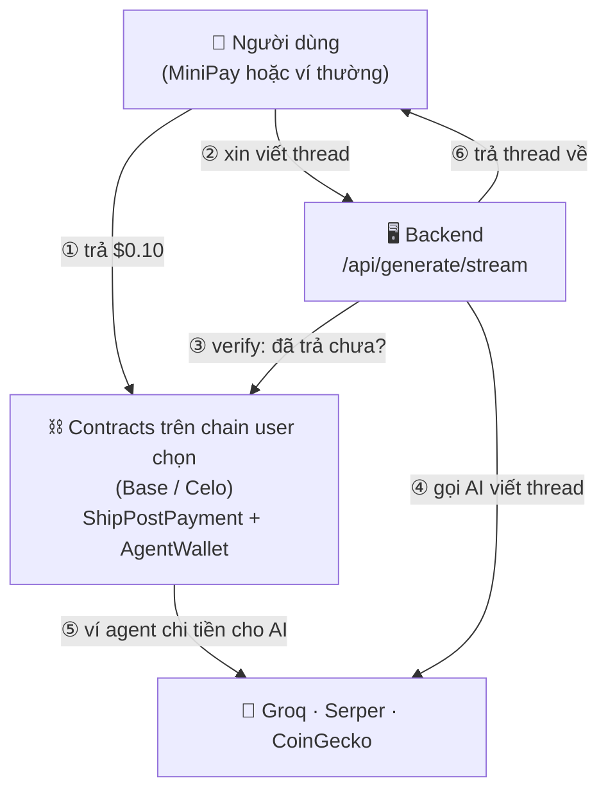

**Một câu để nhớ:** blockchain ở đây **không chạy AI** — nó là *sổ kế toán bất biến* cho cả thu
lẫn chi; AI chạy off-chain trong backend.

> **Trước khi trả:** user xem **tweet đầu tiên miễn phí** (`/api/preview` — không tốn xu, không
> đụng ví agent, không ghi DB) rồi mới bấm **Unlock** để chạy luồng ①–⑥ ở trên. Chi tiết §2.7.

---

# Tầng 1 — Bức tranh lớn

## Hai lớp tách bạch

Toàn hệ thống chia làm **2 lớp**, nối nhau bằng đúng một thứ: `payTxHash` (bằng chứng đã trả).

| Lớp | Gồm gì | Trách nhiệm |
|---|---|---|
| **Lớp 1 — On-chain (Base / Celo)** | `ShipPostPayment` + `AgentWallet` | Thu tiền (`payForThread`) và chi tiền (`executeX402Call`), để lại event/tx bất biến |
| **Lớp 2 — Backend (Next.js SSE)** | `/api/generate/stream` + pipeline | Verify thanh toán, gọi AI off-chain, settle x402, stream kết quả về client |

Vì sao tách: contract đơn giản → rẻ và an toàn; backend không được tin → phải *chứng minh lại*
mọi thứ từ chain. (Frontend và Data nằm trong Lớp 2 về mặt khái niệm — xem Tầng 2.)

## Một lượt generate chạy ra sao (đọc từ trên xuống)

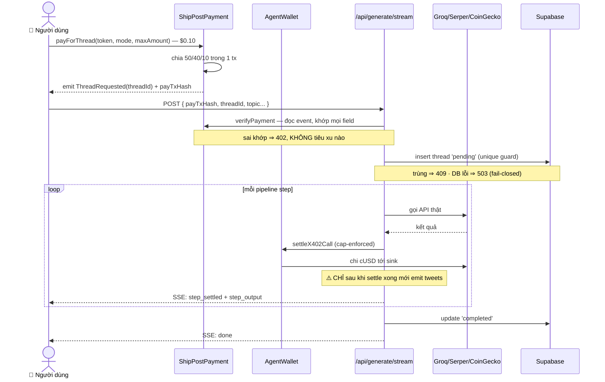

> **Luồng preview** (xem-trước miễn phí) là một đường **chỉ-đọc** tách rời sơ đồ trên: không
> verify, không insert, không settle — chỉ sinh draft rồi trả tweet đầu. Bấm **Unlock** mới vào
> đúng luồng trả tiền này (sinh thread mới, hoàn toàn). Xem §2.7.

> **Dừng ở đây là đủ cho hầu hết người đọc.** Cần biết một mảng cụ thể làm gì → Tầng 2.
> Cần hiểu *vì sao* một bất biến tồn tại → Tầng 3.

---

# Tầng 2 — Từng phần (vừa phải)

Mỗi mục theo công thức: **làm gì · gọi ai · invariant chính**.

## 2.1 On-chain — `contracts/`

Hai contract, deploy độc lập trên mỗi chain được hỗ trợ. Địa chỉ hiện hành nằm trong
`deployments/<chain>.json` và bảng ở `.claude/docs/architecture.md`; Alfajores đã bị Celo khai tử —
dùng Celo Sepolia cho testnet.

| Chain | ShipPostPayment | Token |
|---|---|---|
| Base 8453 | `0x6915a137314e0588b671bc62e619cc4c3109a0b7` | USDC |
| Celo 42220 | `0x921146fab0a60d48e1991495fc8a899d7c989f74` | cUSD, USDT, USDC |
| Celo Sepolia 11142220 | `0x277e140933d600cafcad38e2f1018e4fbd5476b2` | mock |

Mỗi lần redeploy, `threadCounter` bắt đầu **trên** counter của contract cũ (Base 1000000, Celo
200000) — DB vốn đã an toàn nhờ unique index `(chain_id, onchain_thread_id)`, nhưng một id trần
trong log sẽ mơ hồ nếu trùng.

**`ShipPostPayment`** — máy chia tiền. `payForThread(token, mode, maxAmount)` kéo đúng giá hiện
hành từ user, chia tức thì rồi emit. Giá là **state có thể đổi** (`priceUsdCents`, `setPrice` chỉ
owner) chứ không phải hằng số biên dịch cứng, nên đổi giá không còn là một cuộc redeploy. Đúng vì
thế mà `maxAmount` tồn tại: nó là **trần đồng ý của người trả**, chặn kịch bản owner đổi giá đúng
vào khoảng trống giữa lúc user đọc giá và lúc tx của họ lên chain (revert `PRICE_EXCEEDS_MAX`).

Hệ quả lan ra ngoài contract: mọi thứ định giá một lần trả **trong quá khứ** phải đọc
`ThreadRequested.amount` của chính thread đó, không được đọc `requiredAmount()` ở head — chi tiết
trong §3.5 và `.claude/docs/refunds.md`.

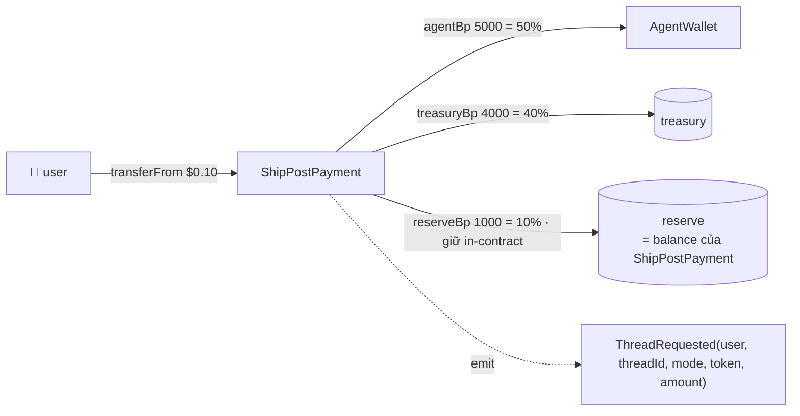

- **Làm gì:** thu tiền, chia 50/40/10 (10% **giữ lại làm reserve on-chain** — nguồn trả refund), phát `ThreadRequested`. v2 thêm `refund()` / `withdrawReserve()` (owner-only).
- **Invariant:** đa token không hardcode decimals (`requiredAmount` đọc `decimals()`); wei lẻ luôn
  rơi vào reserve (dùng phép trừ); `ThreadRequested` chính là API mà backend đọc ngược để verify.

**`AgentWallet`** — ví agent ERC-8004, giữ stablecoin để chi x402.
- **Làm gì:** `executeX402Call` chuyển tiền cho dịch vụ, kèm **daily spend cap** $10/token/ngày (mainnet; $50 testnet).
- **Gọi bởi:** chỉ owner (orchestrator EOA của backend).
- **Invariant:** cap chặn blast-radius nếu key lộ; `Pausable` là kill-switch (nhưng
  `emergencyWithdraw` cố tình vẫn chạy khi paused — chi tiết Tầng 3).

## 2.2 Backend — `/api/generate/stream`

Trái tim Lớp 2. `POST` (`app/api/generate/stream/route.ts`) spends cUSD thật mỗi lượt, nên coi
body là **thù địch**. Ba cổng gác trước khi tiêu xu nào:

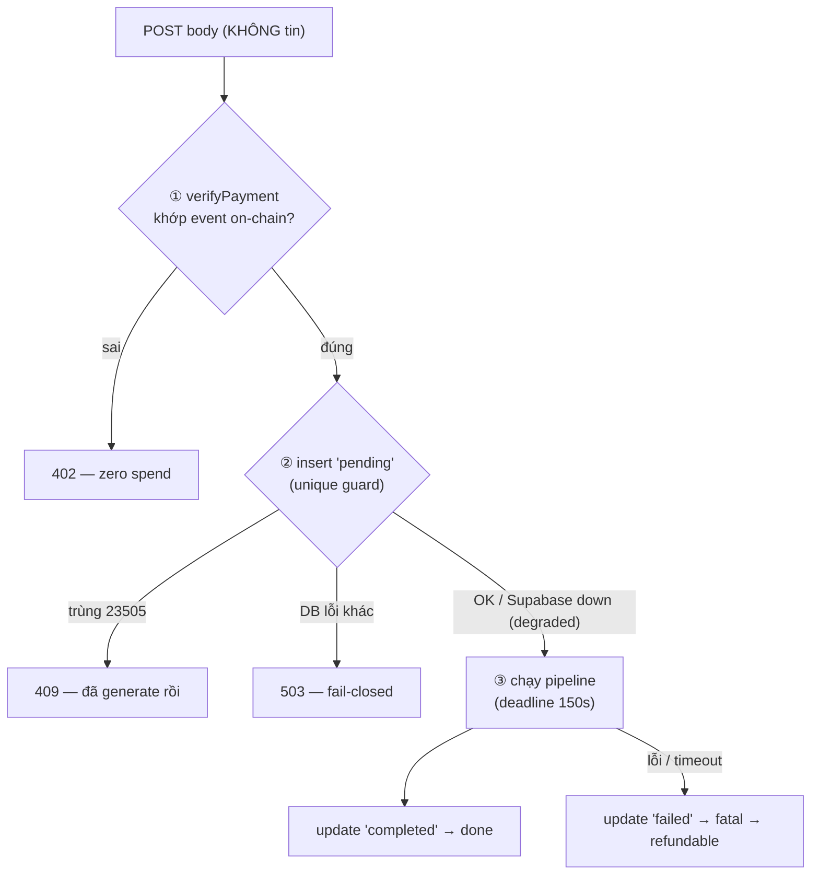

- **Làm gì:** verify thanh toán → chống replay → chạy pipeline → stream SSE.
- **Gọi ai:** `verifyPayment`/`settleX402Call` (Lớp 1), Supabase, các API AI.
- **Invariant:**
  - Verify on-chain **trước** mọi việc tốn tiền; sai → 402, zero spend.
  - Một payment = một generation (unique index `(chain_id, onchain_thread_id)`).
  - **Mọi lỗi đều về trạng thái sạch, refund được** (vòng đời dưới).

Vòng đời một thread:

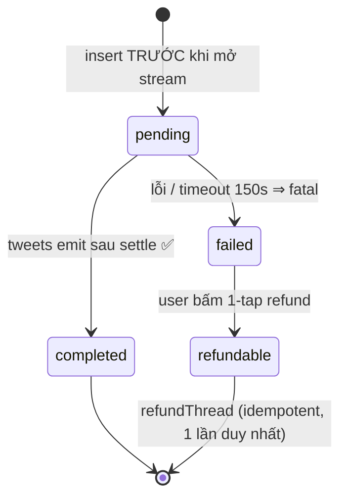

Pipeline có **6 mode**, khai báo trong `lib/pipeline/modes/` và tra ra bằng `getMode(body.mode)`.
Mỗi mode là một `ModeDef` tự khai chuỗi bước của nó; route chỉ biết `UnifiedModeOutput` chung
(`tweets` + `totalCostUsd` + context), nên thêm mode không phải sửa route.

| id | key | Nguồn ngoài Groq | Ghi chú |
|---|---|---|---|
| 0 | `educational` | Serper | chạy qua `runModeA` |
| 1 | `hotTake` | Serper · CoinGecko | chạy qua `runModeB` |
| 2 | `tokenAnalysis` | Serper · CoinGecko · DefiLlama | |
| 3 | `dailyRecap` | Serper · CoinGecko · DefiLlama | input-free (không có `topic`) |
| 4 | `comparison` | Serper · DefiLlama | `topic` mã hoá `"<aKey>\|<bKey>"` |
| 5 | `newsReaction` | Serper · CoinGecko | |

> **`ModeDef.id` phải bằng đúng `uint8` mà `ThreadRequested` phát ra** — nó là field được
> `verifyPayment` khớp lại. Bảng này **append-only**: không bao giờ đánh số lại một mode đã có,
> vì id cũ đã nằm vĩnh viễn trong log on-chain. Chuỗi hiển thị của mode chỉ có một chỗ ở
> `lib/threadLabel.ts` (`MODE_CODE` + `MODE_FALLBACK`).

Hình dạng chung của một mode (lấy id 1 `hotTake` làm ví dụ). `defiLlamaStep` của các mode 2–4 là
fetch thuần: **free, không API key, không settle**, soft-fail về null.

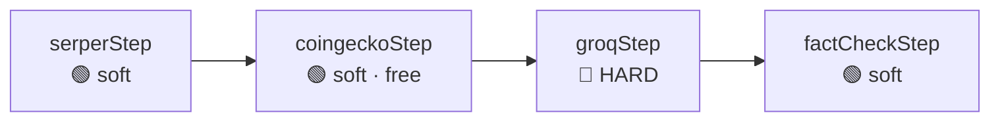

🟢 **soft-fail** → emit `step_failed` (không terminal), chạy tiếp với context null. 🔴 **hard-fail**
(groq) → `throw` → cả run fail → refundable. (Vì sao thứ tự emit quan trọng → Tầng 3.)

> Phần *gọi API* của `serperStep`/`coingeckoStep`/`generateDraft` được tách thành helper **thuần**
> (`fetchSerper`/`fetchCoinGecko`/`generateTweets`) — luồng preview miễn phí (§2.7) tái dùng chúng
> nhưng bỏ phần `settleX402Call`/emit. Step trả phí vẫn settle như cũ.

## 2.3 x402 — hai mô hình (ĐỪNG nhầm)

Codebase có **hai cơ chế khác bản chất**, cùng tên "x402", chảy tiền **ngược chiều nhau**.

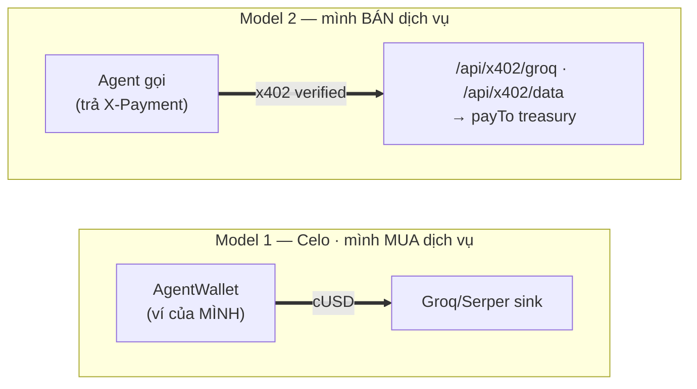

| | Model 1 — Celo in-process | Model 2 — `/api/x402/*` |
|---|---|---|
| Vai trò | Mình **MUA** dịch vụ | Mình **BÁN** dịch vụ |
| Giao thức | Mô phỏng, không có `X-Payment` | x402 **thật** qua `@x402/next` |
| Ai trả | AgentWallet chi cho service | **Người gọi** trả cho mình |
| Settle về | sink/burn (`X402_SINK_ADDRESS`) | `X402_PAY_TO` treasury |
| Rủi ro nếu hở | Drain AgentWallet | Không — không trả thì không có content |
| Mạng | Celo (42220 / 11142220) | Celo 42220 (từ 2026-08-04; trước đó Base) |

**Model 1** giờ là đường settle của Serper/CoinGecko/FactCheck — và là **fallback** cho Groq khi
đường x402 gặp sự cố hạ tầng (facilitator down, hết credit, đụng cap, hết float): `generateDraft`
bắn Discord alert rồi rơi êm về push-to-sink, user vẫn nhận thread. **Model 2** từ 2026-07 là đường
chính của Groq cho **mọi** thread trả phí: `getSettleMode()` đọc `X402_SETTLE_MODE` +
`X402_CHAIN_ID` từ env (tách khỏi chain thanh toán — user vẫn trả cUSD trên Celo), agent EOA ký
`X-Payment`, facilitator settle USDC về `X402_PAY_TO`, **không chạm AgentWallet**. `step_settled`
mang `chainId` để UI link đúng explorer của chain settle (`explorerBase()` — Celoscan hay Basescan).
Rollback: đổi env, hoặc tức thời `redis set x402:paused 1` (= fallback về Model 1, không phải
outage).

**Facilitator nào đang chạy** — chọn bằng `X402_FACILITATOR_AUTH`, *đặt tên chứ không suy ra*: creds
CDP sống dai hơn một lần đổi chain, nên suy-ra-từ-env từng khiến facilitator Celo nhận JWT của
Coinbase và fail như thể nó chết (`lib/x402/server.ts`).

| | Celo (đang chạy, từ 2026-08-04) | Base / CDP (nhánh cũ, vẫn còn code) |
|---|---|---|
| `X402_FACILITATOR_URL` | `https://api.x402.celo.org` | `https://api.cdp.coinbase.com/platform/v2/x402` |
| `X402_FACILITATOR_AUTH` | `api-key` (header `X-API-Key`) | `cdp` (JWT ~2 phút, scope theo path) |
| `X402_CHAIN_ID` | `42220` | `8453` |
| Giá dịch vụ | `X402_PRICE_USD` = $0.001 USDC | như trên |
| Chi phí vận hành | **credit trả trước, $0.001/settle**, mua tại x402.celo.org — hết credit ⇒ 402 `insufficient_credits` ⇒ rơi về Model 1 | gas do CDP lo |

Facilitator Celo còn ở x402 **v1**, nên `cfg.v1Network` bật `V1DowngradeFacilitator` — cả hệ thống
phía trên vẫn nói v2, dịch xuống v1 đúng tại biên đó. Bỏ `v1Network` khỏi bảng chain là rollback
toàn bộ.

**Hai mặt hàng đang bán** (cùng rail, cùng giá `X402_PRICE_USD`, cùng `withX402`):

| Route | Bán gì | Chi phí phục vụ mỗi lần bán |
|---|---|---|
| `/api/x402/groq` | một lượt gọi LLM (`GROQ_MODEL`) | một lượt inference Groq |
| `/api/x402/data` | market snapshot CoinGecko, cache 60s | gần như không — một lượt upstream phục vụ mọi buyer |

`/api/x402/data` là bản không-LLM của route groq: `getRows()` (`lib/x402/marketSnapshot.ts`) gom
top-250 + bộ Celo pin sẵn vào một snapshot dùng chung, filter `coins` áp lên **cache** chứ không bắn
thêm request lên CoinGecko, nên chi phí upstream không tăng theo số lần bán. Hai lối thoát của nó cố
ý **không** settle: upstream chết trong lúc cache lạnh ⇒ `502`; `coins` không khớp gì ⇒ `422` (bad
request, không phải một lần bán). Cache còn ấm thì snapshot cũ được trả ra và lần bán vẫn tính —
dữ liệu thật cũ vài giây tốt hơn một lần bán hỏng.

Lịch sử: route `/api/x402/*` *đời đầu* là proxy không xác thực gọi thẳng `settleX402Call` (drain
free) — xóa ở `8f4c222`; Model 2 hiện tại (`c8a796b`) là bản dựng lại an toàn. **Rule:** mọi x402
surface công khai phải verify `X-Payment` trước khi chi. Xem thêm `docs/x402-explained.md`,
`docs/x402-flow-diagrams.md`, `docs/x402-mainnet-proof.md`.

## 2.4 Frontend — `app/` + `components/` + `hooks/`

Next.js 14 App Router, **mobile-only** (MiniPay webview), **dark mode** mặc định, budget `<200KB`
gzipped trên `/`. Luồng client nối tiếp nhau:

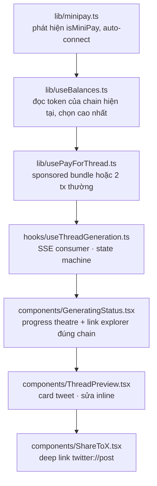

Không có gì trong chuỗi này pin cứng một chain: `useBalances` đọc `getTokens(chainId)` (nên nó
hiện đúng USDC trên Base, cUSD/USDT/USDC trên Celo), còn link explorer sinh từ `explorerBase()`.

`usePayForThread` chọn **một trong hai đường** ngay tại thời điểm trả tiền:

- **Sponsored (EIP-5792).** Hỏi ví bằng `getCapabilities`; nếu ví khai `paymasterService`, gộp
  approve + `payForThread` thành **một** `sendCalls` kèm sponsorship → user không tốn gas, và
  không còn khe hở giữa hai call để approve chết ở giữa (đúng lớp bug approve-receipt của USDT).
  URL paymaster là secret server-side nên client đi qua `/api/paymaster` — proxy **deny-by-default**,
  chỉ chuyển tiếp `pm_getPaymasterStubData` / `pm_getPaymasterData` và chỉ cho chain/contract/selector
  đã biết, có rate limit.
- **EOA thường.** Ví không trả lời được `wallet_getCapabilities` (MiniPay nằm ở đây) thì coi như
  EOA và đi đường hai tx như cũ. Không fail, chỉ fallback.

- **Invariant:** `useThreadGeneration` chỉ coi `fatal` là kết thúc lỗi; `step_failed` (soft) chỉ
  hiển thị degraded → khớp triết lý soft/hard ở 2.2.
- **Invariant:** giá hiển thị, số tiền approve và trần `maxAmount` đều đến từ **một** lần
  `readThreadPrice()`. Không tự tính giá ở client — xem §2.1.

## 2.5 Data — Supabase (`supabase/migrations/`)

- **Làm gì:** lưu wallet address + metadata thread (no PII); phục vụ history/analytics.
- **Gọi bởi:** chỉ server-side, **luôn dùng service role** (`getSupabaseServer`) bypass RLS — không
  có anon client. History/analytics qua edge-runtime routes (`/api/public/*`), trang `/app/history`,
  `/app/stats`.
- **Invariant:** `refund_requests` bật RLS không policy permissive (`0005`) → anon bị từ chối.

## 2.6 Refund — runbook

Hai đường settlement, đều gọi `refundThread` (`lib/agent/orchestrator.ts`):

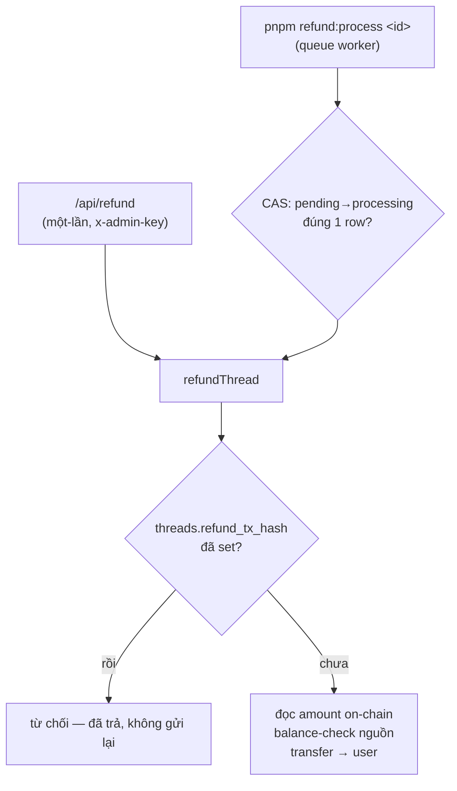

- **Invariant:** `threads.refund_tx_hash` là nguồn sự thật duy nhất — đã set ⇒ không bao giờ gửi lại.
  Số tiền đọc **on-chain** (`getOnChainPaidAmount`), không từ `amount_paid_raw` (client). Lock là
  compare-and-swap (`pending → processing` đúng 1 row). Send lỗi **không** tự revert về `pending`
  (tx có thể đã broadcast) — chỉ reset sau khi xác nhận on-chain không có transfer nào landed.

## 2.7 Free preview — xem tweet đầu miễn phí (`/api/preview`)

User xem **tweet đầu tiên miễn phí** trước khi trả; bấm Unlock mới chạy luồng trả phí (2.2). Preview
là đường **settle-free** hoàn toàn tách khỏi luồng tính tiền.

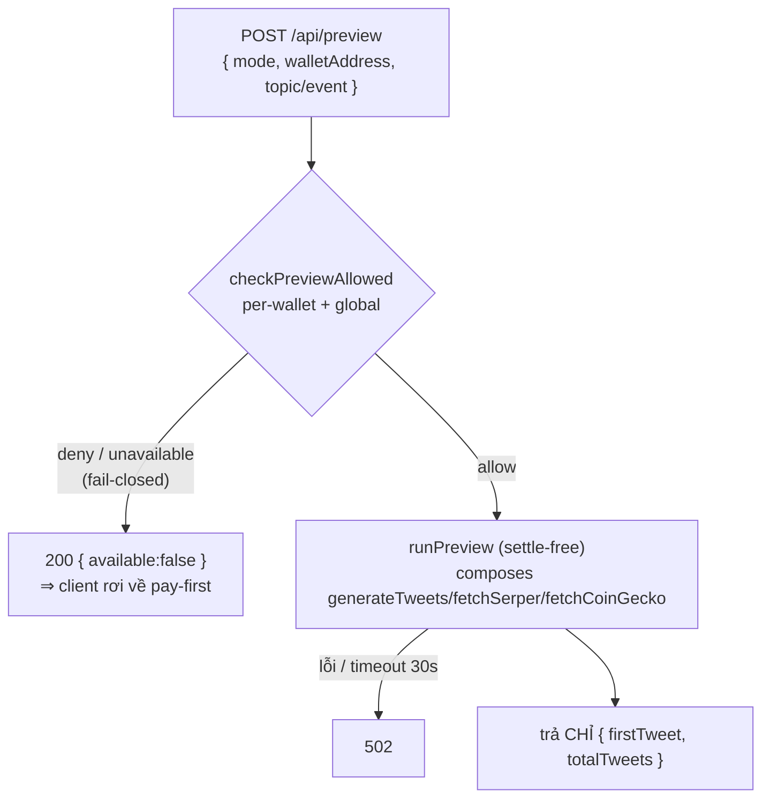

- **Làm gì:** sinh draft *không* settle, trả về đúng tweet đầu + tổng số tweet.
- **Gọi ai:** `runPreview` (`lib/pipeline/runPreview.ts`) dùng helper thuần
  `generateTweets`/`fetchSerper`/`fetchCoinGecko`; rate gate `checkPreviewAllowed` (`lib/rateLimit.ts`).
  Client: `fetchPreview` (`lib/previewClient.ts`) → màn `preview-locked` (`components/PreviewLocked.tsx`),
  điều phối ở `app/HomeClient.tsx` (`beginFlow`/`unlock`).
- **Invariant:**
  - **Drain-safe:** preview **không bao giờ** gọi `settleX402Call`, không chạm AgentWallet, không ghi
    row `threads` — một test source-guard quét chính `runPreview.ts` để ép buộc. Xem §3.6.
  - **Chống rò:** body trả về *chỉ* `firstTweet` + `totalTweets`, không lộ phần còn lại của thread.
  - **Rate gate fail-closed:** khác `checkRateLimit` (fail-open), preview **deny khi limiter chết** —
    vì nó tiêu quota Serper free-tier dùng chung. Per-wallet (3/10ph) + global daily cap
    (`PREVIEW_DAILY_CAP`, mặc định 500); per-wallet chặn trước.
  - **Throwaway:** Unlock chạy lại luồng trả phí **nguyên vẹn** → sinh thread **mới** (preview không
    được tái dùng). Preview hỏng vì bất kỳ lý do gì ⇒ client im lặng rơi về pay-first, **không bao
    giờ chặn việc trả tiền**.

---

# Tầng 3 — Đào sâu (đọc khi sửa lõi / review bảo mật)

## 3.1 `verifyPayment` — từng bước (`lib/agent/orchestrator.ts`)

Body của `/api/generate/stream` hoàn toàn do attacker điều khiển, nên mọi field bị *chứng minh lại*
chứ không tin:

1. Lấy receipt của `payTxHash`, đòi `status === 'success'`.
2. **Quét log do *chính contract của mình* phát ra** (skip nếu `log.address` khác `ShipPostPayment`)
   — không tin `receipt.to`, để chịu được đường router/multicall.
3. Khớp `threadId`, `user`, `token`, `mode` với event `ThreadRequested`.
4. **Defense in depth:** đọc lại `requiredAmount` on-chain, đòi `evt.amount === required` — event
   giả mạo cũng không qua. Lần đọc này **ghim vào `blockNumber` của chính tx thanh toán**
   (`readContract({ blockNumber: receipt.blockNumber })`), không đọc ở head: giá đổi được, nên đọc
   ở head thì một lần `setPrice` sẽ đánh trượt **mọi** thread đang bay — đã thu tiền mà không giao
   hàng. Ghim theo block thì phép so vẫn chính xác tuyệt đối.

Trả về **số tiền on-chain** để backend lưu cái đó; **không bao giờ** lưu `amountPaidRaw` từ client.
Refund về sau tính theo `getOnChainPaidAmount` — đọc `ThreadRequested.amount` của chính thread đó,
không theo DB và cũng không theo giá hiện hành.

## 3.2 Settle gates delivery — vì sao thứ tự emit là bất biến

Trong `runGroqStep` và `runModeB`, settle **phải** xong *trước* khi giao nội dung. Đảo thứ tự =
tái sinh lỗ "free content + refund".

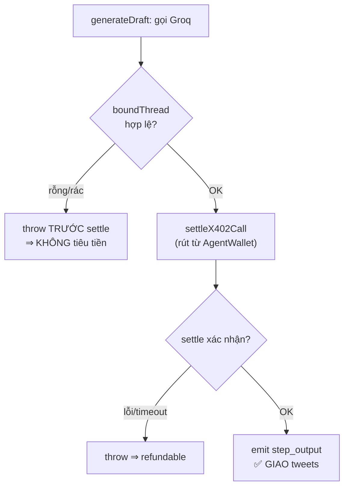

Output rỗng/rác → `boundThread` throw *trước* settle → không tiêu tiền. `waitForTransactionReceipt`
trong `settleX402Call` bounded 90s — RPC chết không treo cả generation.

## 3.3 Daily cap — chi tiết on-chain (`executeX402Call`)

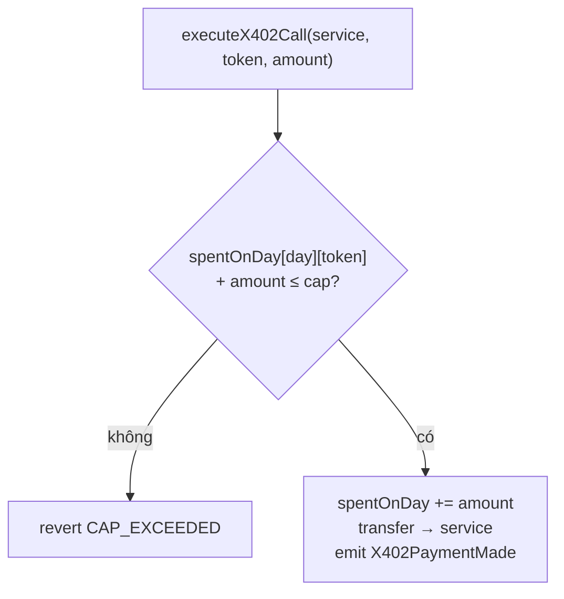

`currentDay() = block.timestamp / 1 days` (cửa sổ 24h UTC). Dù key orchestrator lộ, kẻ tấn công chỉ
rút tối đa $10/token/ngày (mainnet; $50 testnet). `Pausable` đóng băng `executeX402Call` và `approveFacilitator`, **nhưng
`emergencyWithdraw` cố tình vẫn chạy khi paused** — kill-switch để chặn *chi sai*, không phải để
*nhốt tiền*; owner phải luôn rút được ra.

## 3.4 Deadline nội bộ — vì sao 150s < 300s

`route.ts` export `maxDuration = 300`, nhưng pipeline tự đặt `PIPELINE_DEADLINE_MS = 150_000`
(`withDeadline`). Lý do: platform SIGKILL ở 300s là kill cứng, không emit `fatal`, thread kẹt
`'pending'` — trạng thái tệ nhất (đã trả, không content, không tự refund). Tự race timeout sớm hơn →
đi qua `catch` bình thường → `'failed'` + `fatal` → **refundable**.

## 3.5 ✅ Reserve-funded refund (đã fix — v2, deployed 2026-07-06)

**Trước (v1):** contract chỉ route **10%** vào reserve *bên ngoài*, nhưng **full refund trả 100%**
lấy từ balance của deployer EOA → trợ giá thuần, không bền vững (§insolvency).

**Nay (v2 · mainnet `0x0dea32414e884253b51a43b19a6a8c6b8f3b1800`):** 10% được **giữ lại
trong chính contract**; `refundThread` gọi `ShipPostPayment.refund(threadId, token, to, amount)`
(owner-signed) trả từ reserve tích lũy đó — **hard-cap** theo số dư giữ, **idempotent** on-chain qua
`refunded[threadId]`, callable khi paused. Solvent chừng nào tỷ lệ refund ≤ `reserveBp` (10%); nâng
được bằng `updateFeeSplit` không cần redeploy. Reserve mới deploy = 0 → **cần seed** một khoản đệm
trước khi mở traffic thật (xem `docs/reserve-refund-migration.md`).

## 3.6 Preview drain-safety — vì sao tách khỏi luồng phí

Preview là điểm dễ tái sinh đúng lỗ **"free content + refund"** mà cả kiến trúc né tránh, nên nó
được dựng để **không thể** chi tiền:

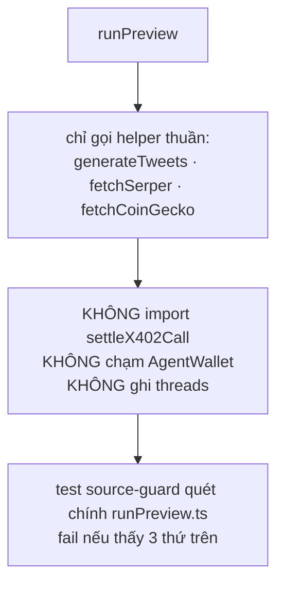

- Các helper `fetchSerper`/`fetchCoinGecko`/`generateTweets` được **tách** khỏi step trả phí
  (`serperStep`/`coingeckoStep`/`generateDraft`) đúng để preview gọi được phần *gọi API* mà bỏ phần
  *settle/emit*. Step trả phí vẫn giữ nguyên `settleX402Call` của nó (§3.2 không đổi).
- Vì preview không tốn xu, nó **không cần** verify on-chain hay insert thread — nhưng vì thế nó tiêu
  quota Serper *miễn phí* dùng chung, nên cổng `checkPreviewAllowed` **fail-closed**: limiter chết ⇒
  deny (đối lập với `checkRateLimit` fail-open ở luồng đã-trả-tiền). Per-wallet chặn trước global để
  một kẻ lạm dụng chạm trần của *chính nó* trước khi ăn vào ngân sách chung.
- Unlock **không** tái dùng draft preview — nó chạy lại pipeline trả phí, sinh thread mới. Hệ quả:
  preview có thể "phí" một lần gọi Groq, nhưng đổi lại đường tính phí **không bao giờ** phụ thuộc
  state của đường miễn phí.

## 3.7 Sáu bài học thiết kế

1. **On-chain = sổ kế toán bất biến, không phải máy tính.** Thu/chi để lại event/tx; AI off-chain.
2. **Không tin client — verify lại từ chain.** `verifyPayment` + amount on-chain là khuôn mẫu chống forge.
3. **Giới hạn blast radius bằng code:** daily cap, Pausable, whitelist token, insert fail-closed.
4. **Settle trước, giao hàng sau** — invariant chống "free content + refund".
5. **Mọi lỗi phải refundable**, kể cả timeout — deadline nội bộ thay vì để platform kill cứng.
6. **Đường miễn phí phải không-thể-chi-tiền:** tách helper thuần, source-guard ép no-settle, rate
   gate fail-closed, draft throwaway — preview không bao giờ chạm ví agent hay DB (§3.6).

---

# Phụ lục

## Chain config (`lib/`)

- `lib/chains.ts` — chain nào **tồn tại**: `getChain`, `explorerBase`, `celoSepolia`. Không giữ allowlist.
- `lib/chainPolicy.ts` — chain nào deployment này **chấp nhận**: `SUPPORTED_CHAIN_IDS`,
  `DEFAULT_CHAIN_ID`, `isSupportedChain`, `chainLabel`, `isTestnet`, `isMiniPayChain`. Thay cho
  `lib/targetChain.ts` (đã xóa — nó giả định đúng một chain).
- `lib/wagmi.ts` — đăng ký mọi chain được hỗ trợ, mỗi chain một transport, default đứng đầu.
- `lib/threadPrice.ts` — `readThreadPrice()`, giá có thẩm quyền. Không fallback về hằng số local.
- `lib/payBundle.ts` — `buildPayCalls()`, batch approve+pay theo EIP-5792.
- `lib/tokens.ts` — map token theo chain. Trả `Partial<...>` vì Base không có cUSD.
- `lib/contracts.ts` — địa chỉ ShipPostPayment + AgentWallet cho mọi chain.

## Lệnh hay dùng

```bash
pnpm dev                 # dev server
pnpm build               # production build
pnpm test:contracts      # Hardhat tests
pnpm compile             # compile Solidity
pnpm deploy:testnet      # deploy Celo Sepolia (11142220)
pnpm refund:list         # liệt kê refund_requests đang pending
pnpm refund:process <id> # settle một refund đã queue

# Deploy / cấu hình một chain. DEPLOY_TARGET = base | baseSepolia | celo, được
# assert với chainId đang kết nối trước khi gửi bất cứ thứ gì.
DEPLOY_TARGET=base npx hardhat run scripts/deploy-chain.ts --network base
# Áp lại cấu hình post-deploy (idempotent) — dùng để cứu một deploy chết giữa
# chừng. TUYỆT ĐỐI không redeploy để chữa: làm vậy là bỏ rơi contract đang sống.
DEPLOY_TARGET=base npx hardhat run scripts/configure-chain.ts --network base
```

## Glossary

Thuật ngữ junior hay vấp khi đọc codebase này (xếp theo bảng chữ cái).

| Thuật ngữ | Nghĩa trong ShipPost |
|---|---|
| **AgentWallet** | Contract ví của agent, giữ stablecoin để chi x402; chỉ owner (orchestrator) gọi được, có daily cap. |
| **Base** | Blockchain EVM của Coinbase (mainnet 8453, Sepolia testnet 84532) — chain thanh toán thứ hai, chỉ nhận USDC, có gas sponsorship. |
| **basis points (bp)** | Phần vạn. `10000 bp = 100%`. Fee split 5000/4000/1000 = 50/40/10%. |
| **boundThread** | Hàm validate output: thread rỗng/rác thì `throw` (xảy ra *trước* settle → không tiêu tiền). |
| **Celo** | Blockchain EVM (mainnet 42220, Sepolia testnet 11142220) — chain thanh toán gốc, nơi MiniPay sống. |
| **Celoscan / Blockscout / Basescan** | Block explorer để tra cứu tx; link sinh từ `explorerBase(chainId)`, không hardcode. |
| **chainPolicy** | `lib/chainPolicy.ts` — **allowlist duy nhất** cho câu hỏi "chain này có được chấp nhận không". Khác `lib/chains.ts`, vốn chỉ nói chain nào *tồn tại*. |
| **cUSD / USDT / USDC** | Stablecoin được whitelist, **theo từng chain**: Base chỉ USDC; Celo có cả ba. cUSD 18 decimals, USDT/USDC 6 → không hardcode. |
| **EIP-5792** | Chuẩn cho ví nhận **một batch call** (`wallet_sendCalls`) kèm capability. Ở đây: gộp approve + `payForThread` và xin sponsorship. Ví không hỗ trợ thì rơi về đường EOA. |
| **daily spend cap** | Hạn mức chi mỗi token mỗi 24h (UTC) trong `AgentWallet`; mặc định $10 trên mainnet ($50 testnet). Giới hạn blast-radius nếu key lộ. |
| **degraded mode** | Khi Supabase chết: vẫn phục vụ generate nhưng mất replay-guard (có chủ đích, không phải bug). |
| **ERC-8004** | Chuẩn ví cho agent tự trị; `AgentWallet` thiết kế tương thích. |
| **facilitator** | Dịch vụ verify + settle x402 **thật** và trả gas hộ (chỉ dùng ở Model 2). Đang chạy: facilitator của Celo (`api.x402.celo.org`, credit trả trước); nhánh CDP của Coinbase (Base) vẫn còn code — chọn bằng `X402_FACILITATOR_AUTH`. Xem §2.3. |
| **fail-closed (preview gate)** | `checkPreviewAllowed`: limiter chết ⇒ **deny** (ngược `checkRateLimit` fail-open). Bảo vệ quota Serper free-tier dùng chung. Xem §2.7. |
| **free preview / preview-locked** | Xem tweet đầu miễn phí trước khi trả (`/api/preview` + màn `preview-locked`). Settle-free, không ghi DB; Unlock mới chạy luồng phí (sinh thread mới). Xem §2.7. |
| **mode** | Một trong **6** kiểu thread, khai trong `lib/pipeline/modes/`. `id` = `uint8` on-chain trong `ThreadRequested`, **append-only**. Mode A/B là tên cũ của id 0 (`educational`, qua `runModeA`) và id 1 (`hotTake`, qua `runModeB`). Xem bảng §2.2. |
| **MiniPay** | Ví stablecoin của Opera (webview di động). App chạy như **MiniApp** bên trong nó. |
| **maxAmount** | Trần đồng ý của người trả, tham số thứ 3 của `payForThread`. Giá là state đổi được, nên không có trần thì một lần `setPrice` chen vào giữa lúc đọc giá và lúc tx lên chain sẽ âm thầm thu thêm. Vượt trần ⇒ revert `PRICE_EXCEEDS_MAX`. |
| **orchestrator** | EOA backend, là **owner** của `AgentWallet` — chiếc "chìa khoá vương miện"; ký `executeX402Call`. |
| **paymaster** | Dịch vụ trả gas hộ user (CDP, chỉ trên Base). URL là secret server-side; client đi qua proxy `/api/paymaster` deny-by-default. Không set ⇒ ví tự trả gas, app vẫn chạy. |
| **payTxHash** | Hash của tx `payForThread`; **bằng chứng đã trả** mà backend verify lại on-chain. |
| **pipeline step** | Một bước trong `lib/pipeline/`: gọi API thật + settle, phát ra một `PipelineEvent`. |
| **PREVIEW_DAILY_CAP** | Trần global số lượt preview miễn phí mỗi ngày (mặc định 500) — bảo vệ Serper free tier. Env tunable, dùng ở `checkPreviewAllowed`. |
| **replay guard** | Chống dùng lại 1 payment 2 lần — unique index `(chain_id, onchain_thread_id)` trên `threads`. |
| **reserve / treasury** | reserve = 10% mỗi payment **giữ lại trong `ShipPostPayment`** (nguồn trả `refund()` on-chain, v2); treasury = ví nhận 40%. |
| **RLS** | Row Level Security (Postgres/Supabase). `refund_requests` bật RLS, không policy → anon bị chặn. |
| **service role** | Key Supabase **bypass RLS**; chỉ dùng server-side (`getSupabaseServer`). Không có anon client. |
| **settle / settlement** | Chuyển stablecoin on-chain để "thanh toán" một lần gọi dịch vụ (`settleX402Call` → `executeX402Call`). |
| **sink** | Địa chỉ nhận tiền x402 ở Model 1; `X402_SINK_ADDRESS` chưa set = burn về `0x..dead` (demo). |
| **soft-fail / hard-fail** | soft = bước lỗi vẫn chạy tiếp (degraded); hard = lỗi làm cả run `fatal` → refundable. |
| **SSE** | Server-Sent Events — kênh stream một chiều backend → client (progress + tweets). |
| **thread / threadId** | "Thread" = chuỗi tweet sinh ra; `threadId` = id on-chain lấy từ event `ThreadRequested`. |
| **ThreadRequested** | Event `ShipPostPayment` phát khi trả tiền; là "API" mà `verifyPayment` đọc ngược. |
| **wagmi / viem** | Thư viện client EVM ở frontend (`wagmi`) và backend (`viem`). |
| **x402** | Cơ chế trả-tiền-theo-lần-gọi bằng stablecoin (HTTP 402). Lưu ý **2 model** khác nhau — xem §2.3. |
| **withX402** | Wrapper `@x402/next` cho Model 2: trả 402, verify `X-Payment`, settle sau khi handler trả 200. |
