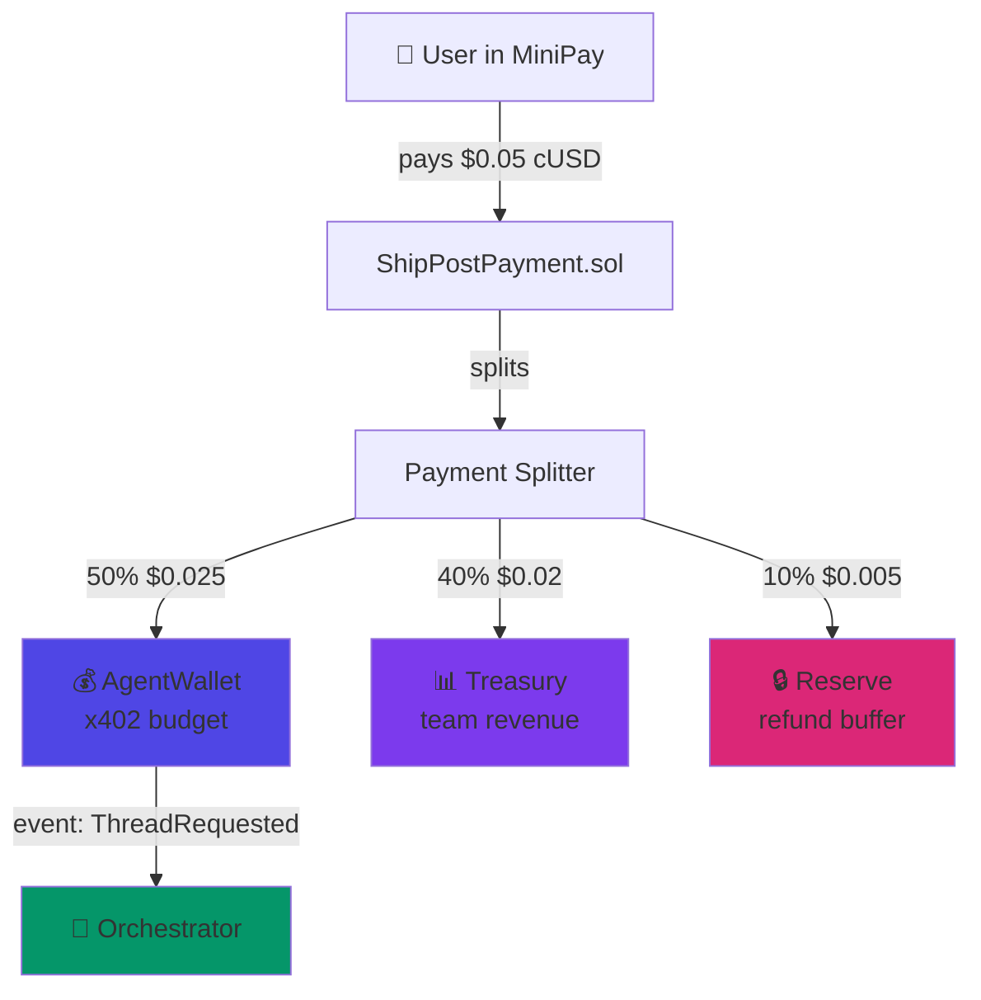
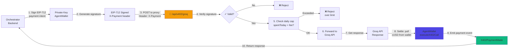
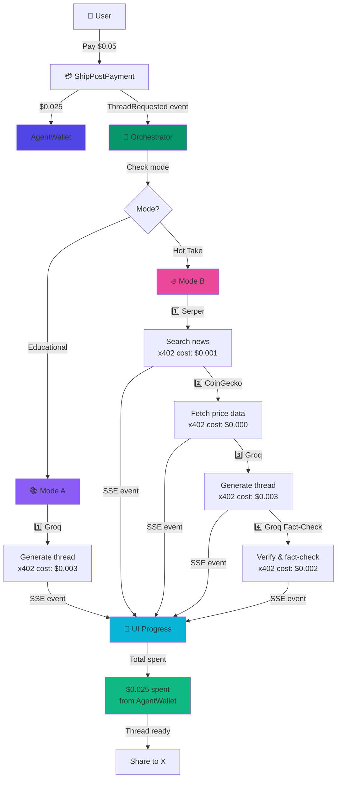
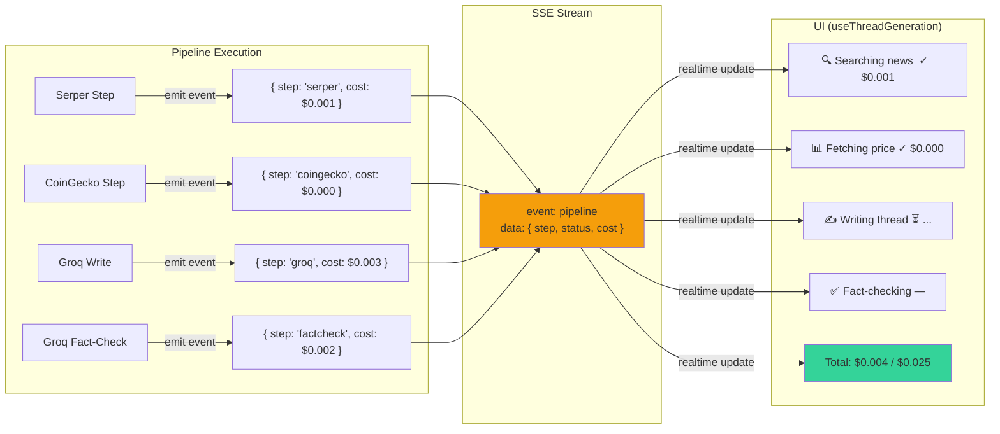
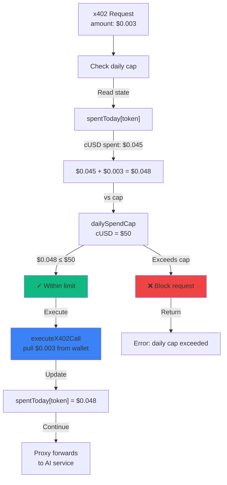
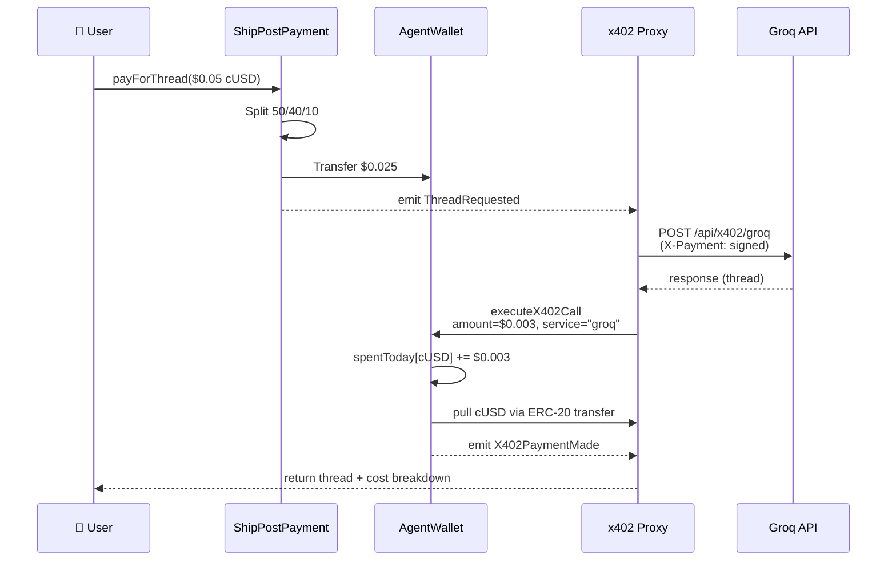

# ShipPost x402 Flow Diagrams

## 1. Payment Distribution Flow (Bước 0)

## 2. x402 Proxy Verification & Settlement Flow

## 3. Full Pipeline Execution Flow

## 4. SSE Stream & UI Progress Theatre

## 5. Agent Wallet Daily Spend Cap Enforcement

## 6. Smart Contract Settlement Flow

---

## File Structure Reference

- **Payment Entry:** `contracts/ShipPostPayment.sol`
- **Budget & Cap:** `contracts/AgentWallet.sol`
- **Proxy Routes:** `app/api/x402/[groq|serper|coingecko|fact-check]/route.ts`
- **Pipeline Logic:** `lib/pipeline/[runModeA|runModeB].ts`
- **UI State Machine:** `hooks/useThreadGeneration.ts`
- **SSE Stream:** `app/api/generate/stream/route.ts`
